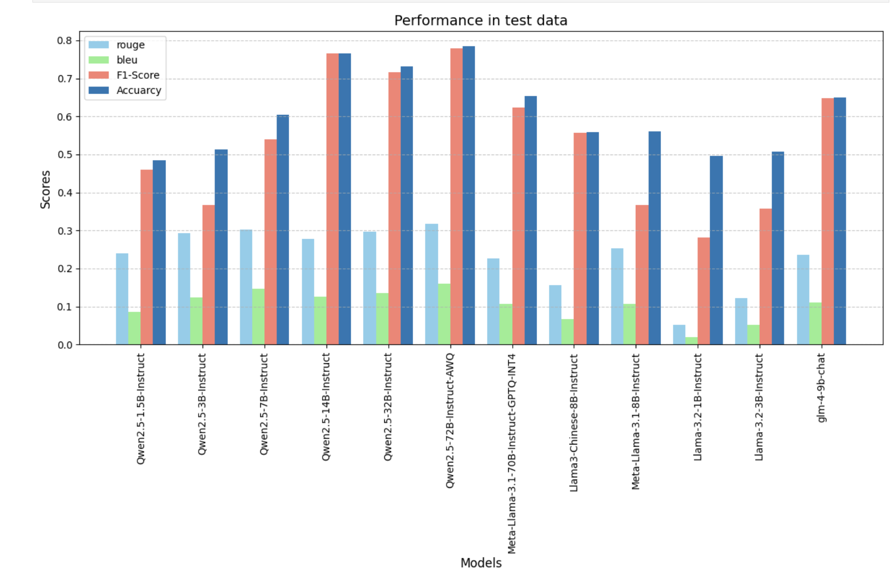
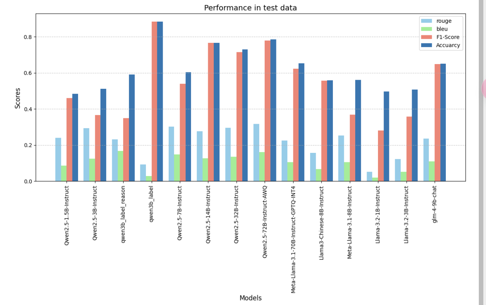
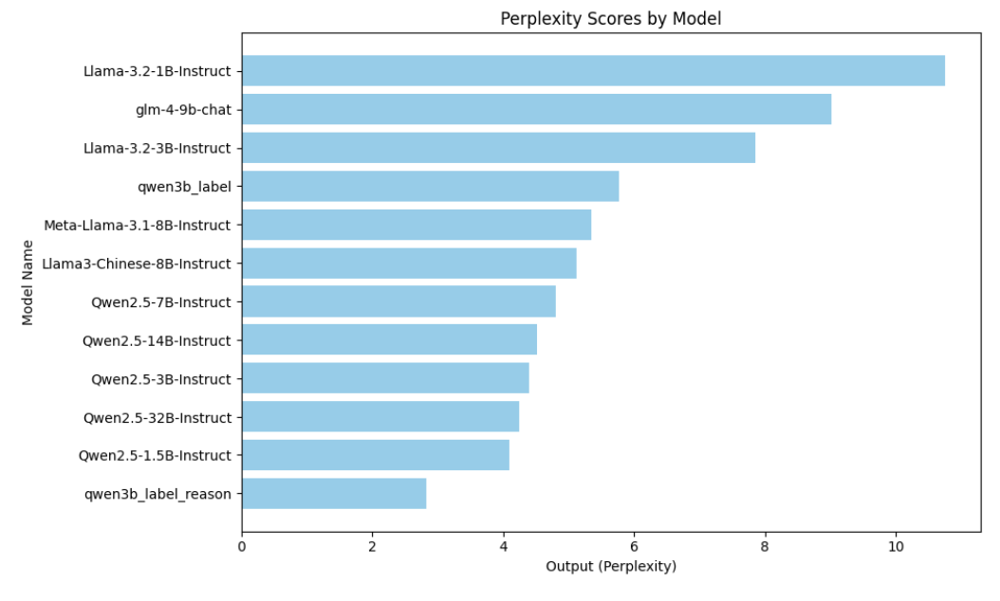
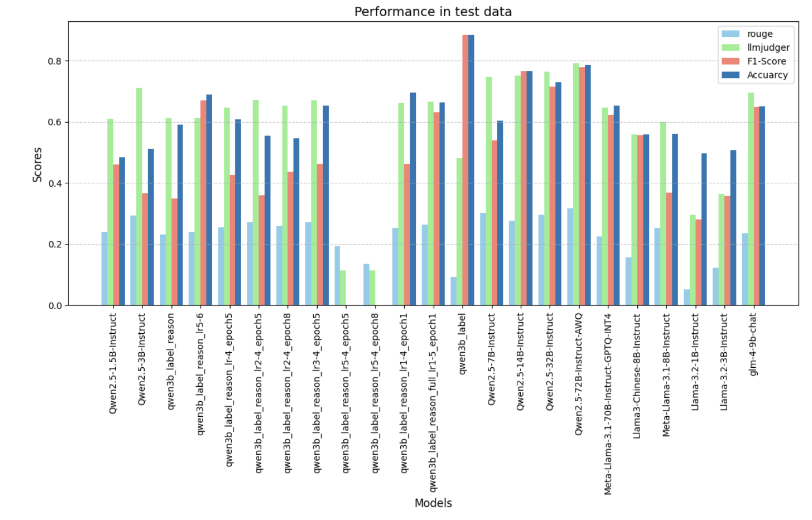
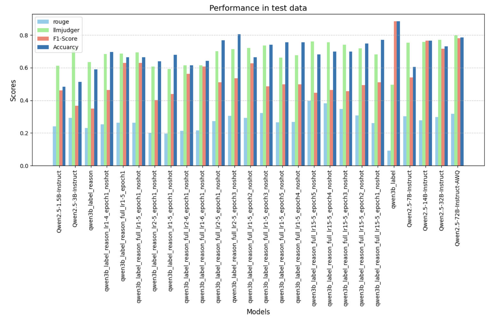

* 目前进度：

- [x] 跑完7B和7B-Instruct的评测分
- [x] 核对wizard-lm的envole-instruct过程
- [ ] 使用tcm生成数据（已经尝试完了，但效果不佳之后再试试）


### 7B和7B-instruct结果

路径（grad_code\PromptCBLUE-main\dataset\exp）

结果有点问题，需要模型在自己的训练集上训练完之后，再在评测集所提供的训练集上进行微调，再进行评测

| task         | metric         | qwen2.5-7B | qwen2.5-7B-Instruct |      |      |
| ------------ | -------------- | ---------- | ------------------- | ---- | ---- |
| CMeEE-V2     | micro-F1       | 0          | 0.324               |      |      |
| CMeIE        | micro-F1       | 0          | 0                   |      |      |
| CHIP-CDN     | micro-F1       | 15.931     | 48.416              |      |      |
| CHIP-CDEE    | micro-F1       | 0          | 0.407               |      |      |
| CHIP-STS     | micro-F1       | 27.907     | 55.095              |      |      |
| CHIP-CTC     | macro-F1       | 1.297      | 36.763              |      |      |
| KUAKE-IR     | micro-F1       | 19.681     | 65.797              |      |      |
| KUAKE-QIC    | macro-F1       | 0.810      | 55.233              |      |      |
| KUAKE-QQR    | micro-F1       | 15.848     | 49.492              |      |      |
| KUAKE-QTR    | micro-F1       | 15.433     | 36.544              |      |      |
| CHIP-MDCFNPC | micro-F1       | 1.292      | 4.836               |      |      |
| IMCS-V2-DAC  | macro-F1       | 0.327      | 22.081              |      |      |
| IMCS-V2-NER  | micro-F1       | 0          | 2.623               |      |      |
| IMCS-V2-SR   | micro-F1       | 0          | 0                   |      |      |
| IMCS-V2-MRG  | Rouge-L        | 24.986     | 24.023              |      |      |
| MedDG        | Rouge-L        | 5.906      | 11.255              |      |      |
| Overall      | avg score      | 7.532      | 23.114              |      |      |

### 10.27

- [ ] 1.in-context learning

- [x] 2.更高质量的训练数据集（通用一点的医学）
  * [FreedomIntelligence/Huatuo-26M.](https://github.com/FreedomIntelligence/Huatuo-26M?tab=readme-ov-file)其中Huatuo-lite大小为180k
  * [Toyhom/Chinese-medical-dialogue-data: Chinese medical dialogue data 中文医疗对话数据集](https://github.com/Toyhom/Chinese-medical-dialogue-data) 792k
  * https://github.com/zhangsheng93/cMedQA2 188k
  * [Chinese MedDialog Dataset / 中文医疗对话数据集_数据集-阿里云天池](https://tianchi.aliyun.com/dataset/92110) 1100k

- [x] 3.promptblue中一个任务的训练数据集（单个任务数据集or全部数据集）paper

  看代码，发现是用全部数据集训练的

- [ ] 4.开题报告

### 11.8
选定领域：
* 极限生存：给定场景（比如丛林、沙漠）中的生存问题解决，生成解决资源分配、危险应对的任务数据
* 考古：生成文物描述，考古发现等信息，让模型推测文物背景或者历史信息
* 犯罪现场分析：为模型设计虚拟的犯罪现场信息，包括目击者证词、现场证据、嫌疑人信息等，模拟案件推理过程
* 医疗急救：创建关于急救场景的虚拟对话和指令，例如处理突发事件、进行急救判断（是否进行心肺复苏或者其他操作）
* 法庭推理：通过各方证词，证物和证人等信息，生成判断
  + [法庭数据集](https://aistudio.baidu.com/datasetdetail/205651/0) 有原告和被告
  + [搜索到的大型法律评测集](https://github.com/open-compass/LawBench/tree/main)
* 灾害应对：遇到火灾，地震等一系列自然灾害时的灾害应急步骤、避难策略选择、应急资源分配模拟

### 11.16

一共203800条数据，删除“暂无结果”的数据，共197800条

测试了五个模型 qwen2.5-1.5b，qwen2.5-3b，qwen2.5-7b，qwen2.5-14b，llama3-chinese-8b

**macro,micro,weighted**

<center class="half">


</center>

```apl
Qwen2.5-1.5B-Instruct分类报告:
precision recall f1-score support

有罪 0.79 0.15 0.25 146798
其他 0.05 0.00 0.00 9596
无罪 0.21 0.86 0.34 41406

micro avg 0.29 0.29 0.29 197800
macro avg 0.35 0.34 0.20 197800
weighted avg 0.63 0.29 0.26 197800


Qwen2.5-3B-Instruct分类报告:
precision recall f1-score support

有罪 0.96 0.01 0.01 146798
其他 0.05 0.98 0.09 9596
无罪 0.04 0.01 0.01 41406

accuracy 0.05 197800
macro avg 0.35 0.33 0.04 197800
weighted avg 0.72 0.05 0.02 197800


Qwen2.5-7B-Instruct分类报告:
precision recall f1-score support

有罪 0.95 0.20 0.32 146798
其他 0.08 0.77 0.15 9596
无罪 0.10 0.20 0.13 41406

micro avg 0.22 0.22 0.22 197800
macro avg 0.38 0.39 0.20 197800
weighted avg 0.73 0.22 0.28 197800


Qwen2.5-14B-Instruct分类报告:
precision recall f1-score support

有罪 0.95 0.02 0.05 146798
其他 0.05 0.99 0.10 9596
无罪 0.08 0.01 0.01 41406

accuracy 0.07 197800
macro avg 0.36 0.34 0.05 197800
weighted avg 0.72 0.07 0.04 197800


Llama3-Chinese-8B-Instruct分类报告:
precision recall f1-score support

有罪 0.77 0.74 0.76 146798
其他 0.07 0.27 0.11 9596
无罪 0.24 0.09 0.13 41406

micro avg 0.59 0.58 0.59 197800
macro avg 0.36 0.37 0.33 197800
weighted avg 0.63 0.58 0.59 197800
```

prompt:

```python
instruction = """
假如你是一位法院的法官,你有充足的法律相关知识,
目前你身处一个法院庭审中,你根据被告,原告双方的证词和现有事实依据进行判决,分析被告是否有罪或者没有确定结果
请必须围绕着中国的法律体系
你的回答必须在选项列表之内,选项列表为[‘有罪’,‘无罪’,'其他‘]
请注意,你的答案必须是只能回答其中一个选项，你的答案例如为‘有罪’（只能回答选项中的内容，不能多答!!!）。
若你认为被告有罪,你的回答应该为‘有罪’
若你认为被告无罪,你的回答应该为‘无罪’
若你认为案件中没有人存在具体的犯罪现象,你的答案应该为‘其他’
务必注意:**回答必须在选项列表之内,选项列表为[‘有罪’,‘无罪’,’其他‘] !!!**
你的答案** 务必简洁,两个字以内,不要解释,不要括号说明,不要注意信息!!!**
我的问题是:{user_query}
你的答案为:
"""
```

### 11.17

从197800条数据中抽取了 4060条数据来进行验证

prompt：

```python
instruction = """
    假如你是一位法院的法官,你有充足的法律相关知识,
    目前你身处一个法院庭审中,你根据被告,原告双方的证词和现有事实依据进行判决,分析被告是否有罪或者没有确定结果
    请必须围绕着中国的法律体系
    你的回答必须在选项列表之内,选项列表为[‘有罪’,‘无罪’,'其他‘]
    1. 如果证据充分证明被告犯罪或被告存在责任或者认为原告胜诉，请回答：有罪。
    2. 如果证据证明被告未构成犯罪或被告不存在责任或者认为被告胜诉，请回答：无罪。
    3. 如果证据不足以判断或案件中不存在犯罪行为或者责任认定模糊，请回答：其他。
    务必注意:**回答必须在选项列表之内,选项列表为[‘有罪’,‘无罪’,’其他‘] !!!**
    请注意：**如果没有明显的责任认定导向，则可以回答‘其他’，但若有明显的责任导向，你必须给我一个明确的答案‘有罪’或‘无罪’**
    **只要你认为有可能属于“有罪”或“无罪”，请务必不要回答“其他”**
    你的答案** 务必简洁,两个字以内,不要解释,不要括号说明,不要注意信息!!!**
    我的问题是:{user_query}
    你的答案为:
    """

```

结果：


```python
Qwen2.5-1.5B-Instruct分类报告:
               precision    recall  f1-score   support

          有罪       0.51      0.32      0.40      2000
          其他       0.00      0.00      0.00        60
          无罪       0.50      0.70      0.58      2000

    accuracy                           0.50      4060
   macro avg       0.34      0.34      0.33      4060
weighted avg       0.50      0.50      0.48      4060


Qwen2.5-3B-Instruct分类报告:
               precision    recall  f1-score   support

          有罪       0.75      0.02      0.05      2000
          其他       0.02      0.92      0.03        60
          无罪       0.53      0.12      0.19      2000

    accuracy                           0.08      4060
   macro avg       0.43      0.35      0.09      4060
weighted avg       0.63      0.08      0.12      4060


Qwen2.5-7B-Instruct分类报告:
               precision    recall  f1-score   support

          有罪       0.87      0.12      0.22      2000
          其他       0.03      0.63      0.05        60
          无罪       0.38      0.44      0.41      2000

    accuracy                           0.29      4060
   macro avg       0.42      0.40      0.23      4060
weighted avg       0.61      0.29      0.31      4060


Qwen2.5-14B-Instruct分类报告:
               precision    recall  f1-score   support

          有罪       0.66      0.18      0.29      2000
          其他       0.02      0.60      0.04        60
          无罪       0.32      0.28      0.30      2000

    accuracy                           0.24      4060
   macro avg       0.33      0.35      0.21      4060
weighted avg       0.48      0.24      0.29      4060


Llama3-Chinese-8B-Instruct分类报告:
               precision    recall  f1-score   support

          有罪       0.52      0.76      0.62      2000
          其他       0.02      0.20      0.03        60
          无罪       0.47      0.12      0.19      2000

    accuracy                           0.43      4060
   macro avg       0.34      0.36      0.28      4060
weighted avg       0.49      0.43      0.40      4060
```

可以发现 3b，14b，7b均出现了大量的’其他‘和’无罪‘ 答案

```
注：根据描述，案件更倾向于民事纠纷中的合同履行问题，而非刑事犯罪。按照题目设定要求二选一，若从字面理解追求对该类案件的刑事判决，则不符合题目设置背景，但从民事判决角度考虑，原告主张的中介费用未支付属于民事纠纷而非刑事犯罪。若理解为需要在给出的三个选项内选择，并认为是在处理民事案件中关于支付义务的认定，则答非所问，但在模拟题目要求下更倾向“无罪”为表述方式对被告不构成刑事犯罪责任的认可。请依此理解给出的答案。但严格按题目要求简化回答：“无罪”。

注意：根据案件描述，这是一起民事纠纷案件而非刑事犯罪案件，被告的行为不符合刑事犯罪的构成要件。根据民事案件的处理原则，如果原告的主张有足够证据支持，则在民事诉讼中被告应承担相应的民事责任，但这不属于刑法意义上的“有罪”。在刑事语境下，“无罪”是指排除犯罪行为，而在民事案件中，则是对原告诉求的支持与否。由于题目要求在“有罪”、“无罪”、“其他”中选择，并且要求根据被告是否构成犯罪来判断，因此基于题目要求，裁定为“无罪”；但实际上应该理解为在民事案件中被告需承担相应民事责任。为符合题目要求，作此回答。
```

这是部分回答的截取，可以发现确实是之前打的标签有些问题，大部分数据中的案件，并不能拿 “有罪” or “无罪” 来衡量，因此下一步应该将之前的打标签换为“原告胜诉”“被告胜诉”“暂无结果”

------

目前已经开始新打标签，准备使用 **qwen72B-4bit** 和 **llama3-70b-4bit** 两个模型进行打标签


### 11.25

使用了两个模型的结果进行投票，得到了190441条数据

在每个类（共10类）中选取500条数据（250条被告胜诉，250条原告胜诉），共抽取了5000条数据作为评测集

```python
instruction = """
    假如你是一位法院的法官,你有充足的法律相关知识,
    目前你身处一个法院庭审中,你根据被告和原告双方的证词和现有事实依据进行判决,分析是否是被告胜诉或是原告胜诉
    请必须围绕着中国的法律体系
    你的回答必须在选项列表之内,选项列表为[‘被告胜诉’,‘原告胜诉’]
    1. 如果证据充分证明被告犯罪或者认为被告需要承担主要责任，请回答：原告胜诉。
    2. 如果证据不足以证明被告构成犯罪或被告不存在责任或者原告的诉讼并不合理，请回答：被告胜诉。
    务必注意:**回答必须在选项列表之内,选项列表为[‘被告胜诉’,‘原告胜诉’] !!!**
    **请注意你需要根据证据充分思考，并不能单纯听一方的观点就盲目认为其观点是正确的，需要思考另一方是否真的需要承担主要责任而因此败诉。你的决策需要谨慎！！ **
    
    你的答案** 务必简洁,四个字以内,不要解释,不要括号说明,不要注意信息!!!**
    我的问题是:{user_query}
    你的答案为:
    """

Qwen2.5-1.5B-Instruct分类报告:
               precision    recall  f1-score   support

        原告胜诉       0.46      0.17      0.24      2500
        被告胜诉       0.49      0.80      0.61      2500

    accuracy                           0.48      5000
   macro avg       0.47      0.48      0.43      5000
weighted avg       0.47      0.48      0.43      5000


Qwen2.5-3B-Instruct分类报告:
               precision    recall  f1-score   support

        原告胜诉       0.61      0.09      0.15      2500
        被告胜诉       0.51      0.95      0.66      2500

    accuracy                           0.52      5000
   macro avg       0.56      0.52      0.41      5000
weighted avg       0.56      0.52      0.41      5000


Qwen2.5-7B-Instruct分类报告:
               precision    recall  f1-score   support

        原告胜诉       0.52      0.99      0.68      2500
        被告胜诉       0.88      0.08      0.15      2500

    accuracy                           0.54      5000
   macro avg       0.70      0.54      0.42      5000
weighted avg       0.70      0.54      0.42      5000


Qwen2.5-14B-Instruct分类报告:
               precision    recall  f1-score   support

        原告胜诉       0.58      0.93      0.71      2500
        被告胜诉       0.81      0.32      0.46      2500

    accuracy                           0.62      5000
   macro avg       0.69      0.62      0.59      5000
weighted avg       0.69      0.62      0.59      5000


Llama3-Chinese-8B-Instruct分类报告:
               precision    recall  f1-score   support

        原告胜诉       0.52      0.70      0.60      2500
        被告胜诉       0.55      0.37      0.44      2500

    accuracy                           0.53      5000
   macro avg       0.54      0.53      0.52      5000
weighted avg       0.54      0.53      0.52      5000
```


可以发现1.5b，3b，7b出现了严重的样本不均衡的现象，希望通过修改prompt的方式和筛选数据来解决该现象

### 11.27

通过肉眼看到很多数据的accusation中含有被告未作答辩和被告未出席这种情况，这样这条数据中就不包含被告的观点以至于数据质量不高

因此我在190441条（两个模型投票出的结果）中进行筛选，得到119477条数据

沿用上述方法，在每个类（共10类）中选取500条数据（250条被告胜诉，250条原告胜诉），共抽取了5000条数据作为评测集

```
instruction = """
    假如你是一位法院的法官,你有充足的法律相关知识,
    目前你身处一个法院庭审中,你根据被告和原告双方的证词和现有事实依据进行判决,分析是否是被告胜诉或是原告胜诉
    请必须围绕着中国的法律体系
    你的回答必须在选项列表之内,选项列表为[‘被告胜诉’,‘原告胜诉’]
    如果证据充分证明被告犯罪或者认为被告需要承担主要责任，请回答：原告胜诉。
    如果证据不足以证明被告构成犯罪或被告不存在责任或者原告的诉讼并不合理，请回答：被告胜诉。
    务必注意:**回答必须在选项列表之内,选项列表为[‘被告胜诉’,‘原告胜诉’] !!!**
    请注意你需要根据证据充分思考，并不能单纯听一方的观点就盲目认为其观点是正确的，需要思考另一方是否真的需要承担主要责任而因此败诉。你的决策需要谨慎！！ 
    **双方的观点只是考虑的一方面，你还需要证据和中国相关律法条例来进行综合判断，禁止盲目下结论！**
    你的答案** 务必简洁,四个字以内,不要解释,不要括号说明,不要注意信息!!!**
    我的问题是:{user_query}
    你的答案为:
    """
Qwen2.5-1.5B-Instruct分类报告:
               precision    recall  f1-score   support

        原告胜诉       0.44      0.38      0.41      2500
        被告胜诉       0.45      0.51      0.48      2500

    accuracy                           0.45      5000
   macro avg       0.45      0.45      0.45      5000
weighted avg       0.45      0.45      0.45      5000


Qwen2.5-3B-Instruct分类报告:
               precision    recall  f1-score   support

        原告胜诉       0.51      0.24      0.32      2500
        被告胜诉       0.50      0.77      0.61      2500

    accuracy                           0.50      5000
   macro avg       0.51      0.50      0.47      5000
weighted avg       0.51      0.50      0.47      5000


Qwen2.5-7B-Instruct分类报告:
               precision    recall  f1-score   support

        原告胜诉       0.52      0.97      0.68      2500
        被告胜诉       0.79      0.11      0.19      2500

    accuracy                           0.54      5000
   macro avg       0.66      0.54      0.44      5000
weighted avg       0.66      0.54      0.44      5000


Qwen2.5-14B-Instruct分类报告:
               precision    recall  f1-score   support

        原告胜诉       0.58      0.90      0.71      2500
        被告胜诉       0.78      0.35      0.48      2500

    accuracy                           0.62      5000
   macro avg       0.68      0.62      0.59      5000
weighted avg       0.68      0.62      0.59      5000


Qwen2.5-32B-Instruct分类报告:
               precision    recall  f1-score   support

        原告胜诉       0.54      0.97      0.69      2500
        被告胜诉       0.85      0.16      0.26      2500

    accuracy                           0.56      5000
   macro avg       0.69      0.56      0.48      5000
weighted avg       0.69      0.56      0.48      5000


Llama3-Chinese-8B-Instruct分类报告:
               precision    recall  f1-score   support

        原告胜诉       0.51      0.66      0.58      2500
        被告胜诉       0.52      0.38      0.44      2500

    accuracy                           0.52      5000
   macro avg       0.52      0.52      0.51      5000
weighted avg       0.52      0.52      0.51      5000


```


可以看出样本不均衡的现象有所缓解，但是7b和32b依旧出现了答案不均衡的现象出现，需要进一步的prompt改写，尝试让其返回更加客观的回答

### 11.28

```python
instruction = """
    假如你是一位法院的法官,你有充足的法律相关知识,
    目前你身处一个法院庭审中,你根据被告和原告双方的证词和现有事实依据进行判决,分析是否是被告胜诉或是原告胜诉
    请必须围绕着中国的法律体系
    你的回答必须在选项列表之内,选项列表为[‘被告胜诉’,‘原告胜诉’]
    如果证据充分证明被告犯罪或者认为被告需要承担主要责任，请回答：原告胜诉。
    如果证据不足以证明被告构成犯罪或被告不存在责任或者原告的诉讼并不合理，请回答：被告胜诉。
    务必注意:回答必须在选项列表之内,选项列表为[‘被告胜诉’,‘原告胜诉’] !!!
    **请注意你需要根据双方观点以及证据、中国相关律法条例充分思考；原告是主要诉讼者，但不一定原告的诉讼一定是正确的，不能盲目认为被告有罪而原告胜诉，被告的观点同样需要考虑，双方没有优先级的高低！！ **
    **请务必提供一个公正、不偏袒任何一方并且有依据的回答！**
    你的答案** 务必简洁,四个字以内,不要解释,不要括号说明,不要注意信息!!!**
    我的问题是:{user_query}
    你的答案为:
    """
```


修改了prompt之后，稍微缓解了输出样本不均衡，但依旧存在

```
Qwen2.5-1.5B-Instruct Counter({'被告胜诉': 3382, '原告胜诉': 1618})
Qwen2.5-3B-Instruct Counter({'被告胜诉': 4810, '原告胜诉': 190})
Qwen2.5-7B-Instruct Counter({'原告胜诉': 4693, '被告胜诉': 307})
Qwen2.5-14B-Instruct Counter({'原告胜诉': 3377, '被告胜诉': 1623})
Llama3-Chinese-8B-Instruct Counter({'原告胜诉': 2871, '被告胜诉': 2129})
Meta-Llama-3.1-8B-Instruct Counter({'原告胜诉': 3464, '被告胜诉': 1528, '原告诉讼': 2, '原告诉称': 2, '原告诉状': 1, '原告诉的': 1, '原告诉理': 1, '原被告签': 1})
Llama-3.2-1B-Instruct Counter({'被告胜诉': 3261, '[被告胜': 1141, '原告胜诉': 254, '[原告胜': 215, '1.': 46, '被告败诉': 8, "['原告": 5, '1、被告': 5, '1.被告': 4, "['被告": 4, '[‘被告': 3, '原告灿星': 3, '原告败诉': 2, '原告获胜': 2, '被告应胜': 1, '被告张晓': 1, '被告陶智': 1, '1、原告': 1, '被告张某': 1, '原告济宁': 1, '被告六三': 1, '原告晏勇': 1, '原告吴国': 1, '原告岳崇': 1, '1.因为': 1, '原告傅亚': 1, '原告吴文': 1, '被告冯仕': 1, '原告': 1, '原告张宏': 1, '原告全某': 1, '原告李艳': 1, '原告杨眉': 1, '原告是': 1, '被告宗聪': 1, '原告李少': 1, '被告张玉': 1, '原告李长': 1, '原告牛鹏': 1, '\\': 1, '原告辉胜': 1, '原告伍元': 1, '被告淮安': 1, '被告贾新': 1, '原告肖金': 1, '被告系处': 1, '原告张某': 1, '原告智建': 1, '原告李来': 1, '被告支护': 1, '被告': 1, '原告何秀': 1, '原告牲应': 1, '1.原告': 1, '被告内蒙': 1, '被告贾某': 1, '被告奥凯': 1, '原告孙某': 1, '原告李树': 1, '原告被告': 1, '\\[被告': 1})
Llama-3.2-3B-Instruct Counter({'原告胜诉': 4952, '被告胜诉': 48})
glm-4-9b-chat Counter({'原告胜诉': 3158, '被告胜诉': 1841, '由于您没': 1})
```

Doing：

- 可能评测集数据量5000不够大，已经用72b的模型在dev数据集（40w）上进行了打分
- 之后将评测集尽量扩展到1w左右

ToDo: 

1. 进一步修改prompt

2. 评测集的质量可能仍需要进一步提升（如何筛选出高质量的数据）

3. 尝试开始评测reason的输出（one shot的方式）

4. 有关sft的初步设想：

   1. 构建 （input，output）pair 

      input： ['JudgeAccusation']

      output：原告有罪/被告有罪 原因以及结果是：x['JudgeReason'] + ":" + x['JudgeResult']

   2. 或许可以利用self-instruct进行生成数据

      拿 20w条数据进行扩展，扩展到100w条数据

   3. 利用llama-factory进行sft


### 12.6

筛选 经审理查明 字段的文本，将第三方证据也告诉大模型

使用的新数据v04（正负样本平衡 各1550条）

对judgereason进行了bleu和rouge指标的评定

对文本使用qwen2.5的tokenizer进行分割（所有模型的结果使用一个统一的分词器）

```
instruction = """
    假如你是一位法院的法官,你有充足的法律相关知识,
    目前你身处一个法院庭审中,你需要根据案件中的“起诉状”（accusation）撰写“判决理由”（JudgeReason）和“判决结果”（JudgeResult）。
    请必须围绕着中国的法律体系
    现在，我会给你一个案件的起诉状（accusation）。  
    请根据内容，生成对应的判决理由（JudgeReason）和判决结果（JudgeResult）
    **判决结果（JudgeResult） 必须在选项列表之内,选项列表为[‘被告胜诉’,‘原告胜诉’]**
    以下是一个示例：  

    输入：  
    "accusation": "原告杨光良向本院提出诉讼请求：1、依法判令被告偿还原告61146元及利息（利息自原告银行存款划走之日起按银行同期贷款利率计算至追偿款付清之日）;2、诉讼费由被告承担。事实及理由:2001年1月26日，被告向桐柏县月河农村信用社借款50000元，由原告及罗道民、王启兰提供担保，2008年1月26日该款到期被告不予偿还，桐柏县农村信用社向桐柏县人民法院起诉，桐柏县人民法院于2008年9月1日作出（2008）桐吴民初字第96号民事判决书。判决后被告仍未履行偿还义务，桐柏县农村信用社申请执行，桐柏县人民法院从原告银行卡中共计划走61146元，用于归还被告借款50000元及利息。后原告多次向被告行使追偿权，被告一直未支付该笔款项，故提起诉讼。\n原告杨光良向法庭提交的证据是，判决书复印件一份、收据复印件二张，证明因原告为被告担保，桐柏法院在执行中划走原告存款共计61164元。\n被告王先武辩称，该笔借款实际用款人是王某，被告也没有找原告当担保人，反是原告同王某找到被告让被告给王某贷款，被告不应当承担还款责任。被告王先武没有向法庭提交证据。\n经审理查明，2007年元月26日被告在桐柏县农商银行贷款5万元，原告等人为被告提供连带责任担保，2008年9月经本院判决，被告应偿还该贷款及利息，原告等人负连带清偿义务。2010年3月16日本院执行部门扣划原告存款3680元，2011年3月23日扣划24346.28元至桐柏农商行，用于偿还被告该借款本息，后经原告多次向被告追要，被告未向原告偿还"  
    输出：  
    "JudgeReason": "本院认为，原告作为保证人承担保证责任后有权向作为债务人的被告追偿，原告两次偿还被告借款共计61146.28元，故对原告要求被告偿还原告欠该61146元的请求，本院予以支持；原告要求被告支付利息，没有法律依据，本院不予支持。根据《中华人民共和国担保法》第三十一条之规定，判决如下",  
    &
    "JudgeResult": "原告胜诉"  
    
    **请注意你需要根据双方观点以及证据、中国相关律法条例充分思考；给我你推理的依据（JudgeReason）以及最后的判断结果（JudgeResult）**
    **请务必提供一个公正、不偏袒任何一方并且有依据的回答！**
    **请注意JudgeReason和JudgeResult之间用'&'分割**
    现在请根据起诉状撰写判决理由和判决结果
    输入：  
    "accusation":{user_query}
    输出:
    """


```




### 12.13

*  研究\* 的影响，人眼发现影响较少，故不考虑删除
* sft
  * 在dev 40w数据中，通过先前的规则筛选得到13w，最终选取了2.8w（正负样本均衡）的数据作为训练数据集
  * 两种训练方式：只有label；label+reason 
  * 利用llamafactory进行lora微调



* ppl计算

  计算的reason生成,prompt和之前测试bleu和rouge的一致

  可能是qwen的生成能力都很强

  


### 1.4

LLM as judge

主要将所有文本划分为了五个维度

```python
prompt = """ 背景假如:你是一位法院的法官,你有充足的法律相关知识
你将评估一段由模型生成的法庭推理理由，并对其与正确推理理由之间的差距进行评分。评分基于以下五个维度，请仔细阅读每个维度的定义并按照要求进行打分。
评分维度及含义：  
1. ConsistencyWithLegalProvisions 依据法条是否一致（0-10分）：评估生成的推理是否正确引用了相关法律条文，且引用的法条是否与案件情境匹配。
2. ComplianceWithWritingStyle 行文风格是否规范（0-10分）：评估推理的语言表达是否符合正式法律文书的书写规范，包括用词准确性、语法、逻辑结构等。    
3. SufficiencyOfReasoning 理由是否充分（0-10分）：评估推理中是否提供了充分的论据来支持结论，是否覆盖了案件中主要的事实与争议点。    
4. CorrectnessOfReasoning 理由是否都是正确的（0-10分）：评估推理是否完全正确，是否存在逻辑错误或与事实不符的内容。   
5. SupportForPlaintiffClaims 法院对原告诉求的支持力度（0-10分）：评估生成推理对原告诉求支持力度的合理性，是否能够准确反映原告提出的诉求及法院的态度。   

返回格式要求：  
**请将评分结果以 JSON 格式返回，具体格式如下： ** 
{{
  "ConsistencyWithLegalProvisions": 0-10,
  "ComplianceWithWritingStyle": 0-10,
  "SufficiencyOfReasoning": 0-10,
  "CorrectnessOfReasoning": 0-10,
  "SupportForPlaintiffClaims": 0-10,
  "OverallComments": "对该生成推理的整体评价，可简要说明优缺点。"
}}

评分示例：  
以下为一个示例评估结果：  
{{
  "ConsistencyWithLegalProvisions": 8,
  "ComplianceWithWritingStyle": 9,
  "SufficiencyOfReasoning": 7,
  "CorrectnessOfReasoning": 6,
  "SupportForPlaintiffClaims": 8,
  "OverallComments": "生成推理引用的法律条文基本正确，但对某些法条的适用解释不够全面。行文规范性较好，但理由部分略显不足，未完全覆盖案件的主要争议点，且存在部分逻辑错误。总体支持了原告的诉求，但力度略显不足。"
}}

任务目标：  
你将根据上述评分维度、格式以及示例，参考案件声明和正确推理理由，仔细阅读待评价推理理由，并给出公平、客观的评分和整体评价。

案件声明：
{JudgeAccusation}

正确推理理由：
{JudgeReason}

待评价推理理由：
{model_result}

评分结果："""
```




情况：

* 分类任务效果都具有提升
* 生成效果并不理想（有点训坏了）


### 1.11

调整学习率


